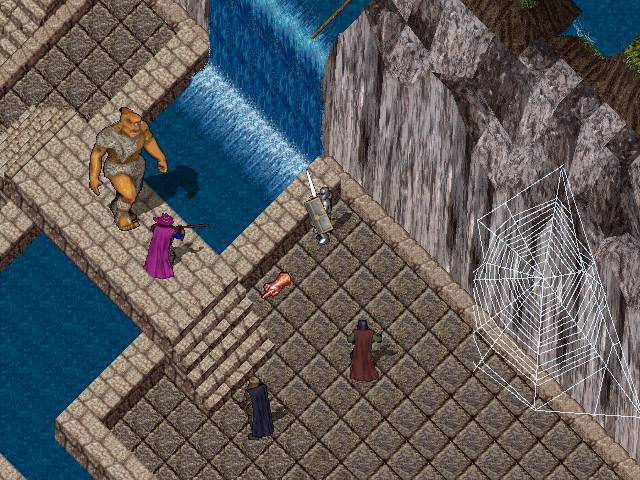
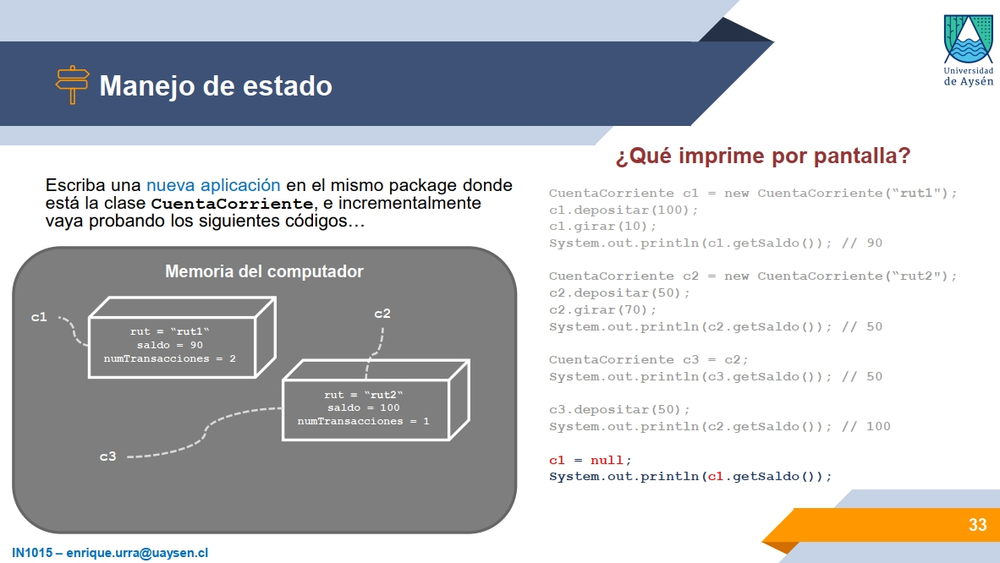
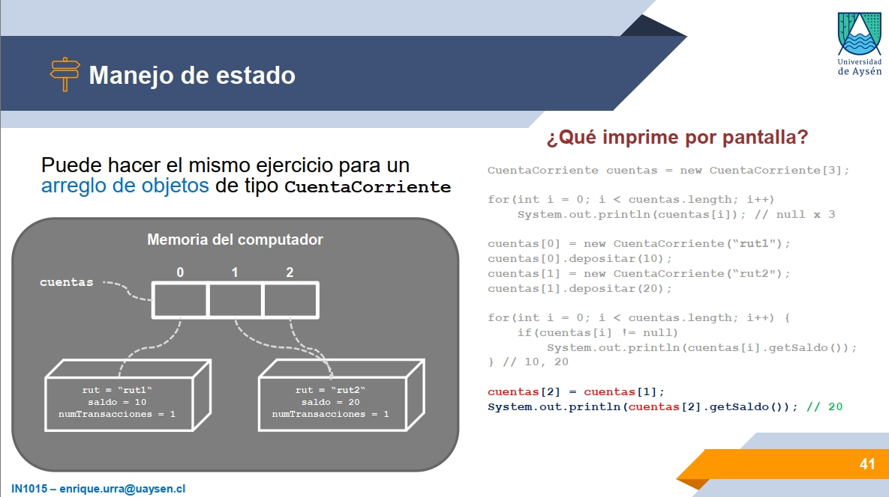

# Some teaching experiences
> *Author*: Enrique Urra - enrique.urra@gmail.com

This is a small repository, or portfolio, in which I share some meaningful ideas and experiences from several years of teaching computer science, informatics and engineering, mainly to undergraduate students of different universities and programs. To teach programming in this context is a real challenge for enthusiasts and practitioners, because it forces you to think about how you are actually thinking when coding, and how you are abstracting in your mind a strange world of data structures, low-level instructions and program flow regarding a specific problem at hand. 

It is really important to *visualize* in some way how a program is operating, or how you really expect it to operate, and to show that to other people with diverse methods of thinking and learning. Because of that, you will see in these examples a lot of visual elements that try to provide a bridge between programming concepts and a concrete practice of solving problems with code.

I wanted to organize these examples in two big groups:

- **Content**, related to specific material and resources that I produced in time for teaching specific programming concepts.
- **Methodology**, related to methods that I applied and improved in time for improving the learning experience of students regarding specific contexts.

## Content

### Case 1: A day of an object in the memory

To learn *object-oriented programming (OO)* is hard. Actually, to learn a procedural programming approach is actually hard, and over that, the object-oriented approach adds to it many concepts and abstractions that require a lot of flexibility in organizing and articulating code. *Polymorphism*? *Encapsulation*? These are not really OO-exclusive concepts, but OO forces you in some way to systematically apply them.

I never learned OO in University. Maybe the basics, but in a mechanical way. I actually really understood and learned OO concepts with this:

For oldies, this is a screenshot of *Ultima Online* (UO), one of the most classic MMORPGs in history. Years ago I spent many hours in that, not only playing but also *coding*. That is because in older times 
(and in present), UO was played in official servers and in *alternative servers*, and the later were implemented and deployed with specific *emulators*. One of them was [RunUO](https://www.runuo.net/), an emulator completely coded in .NET (using C#). These emulators not only allowed to play the game close to the experience of official servers but also through *custom implementations* of the UO world that you can code in C#. I largely collaborated in the customization of local servers by implementing a lot of scripts for new NPCs, game systems and different mechanisms. Being this a pure-OO language, I effectively understood all those alien-OO-concepts that I was taught in university. Imagine that you must implement a class that represent an NPC (a monster in the UO world for example), and to develop its behavior and properties through the class methods and attributes. That was a straightforward approach of OO-learning!

From this experience, I learned one of the key element to effectively learn OO mechanisms: to understand *how objects are running and interacting in the memory of the computer*. In some way, you need to understand the objects that you are manipulating with code, the relationships between them (that are created at runtime) and the effects of their modification in the program behavior, i.e., the *program state*. This is hard because in OO, most of this complexity is direct implemented in classes, that are abstractions of objects. Because of that, you need to *visualize* objects within the first steps. With monsters, weapons and other UO-entities can be more easy to understand, but in common programming tasks, you need to deal with more abstract concepts.

When teaching OO, specifically when teaching Java, I produced some material that allowed me to explain to students how objects live and survive in the memory of the computer, step-by-step from their creation, through its modification and until their destruction. Something like the following image:

It s fundamental to translate very-technical concepts into simpler ones. For example, memory is represented by a simple big-grey-box in which objects live. A single object is simply a rectangular-cuboid, in which some data is defined. This allows to effectively explain that you can have many objects of the same class, and each one has the same properties, but with different values. Live relationships between and/or toward objects (i.e., references) are represented with dotted lines pointing to the related entities.

This gets more interesting when you include arrays in the memory:

In this way, you can effectively explain what is really happening with the code at rightmost part of the diagram, step-by-step, and how memory changes with each line of code. [You can see the complete material here](docs/OO-material-example.pdf), in which these (slides 25-41) and other visual explanations regarding OO-concepts are provided.

### Case 2: 

## Methodology
