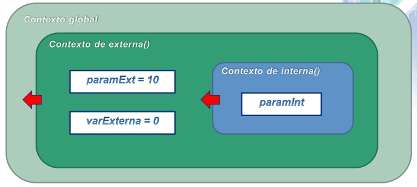
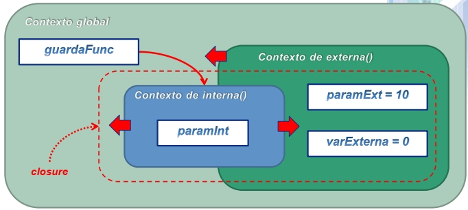
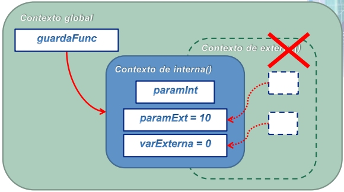
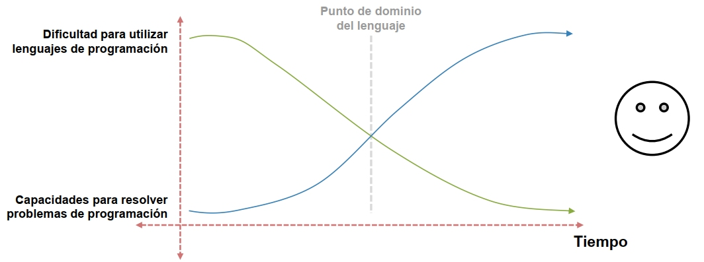
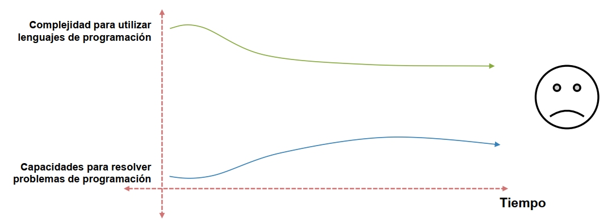

# Some teaching experiences
> *Author*: Enrique Urra - enrique.urra@gmail.com

## Table of Contents  
* [Content](#content)
    * [A day of an object in the memory](#a-day-of-an-object-in-the-memory)
    * [Getting a *closure* with Javascript (not *that* closure)](#getting-a-closure-with-javascript)
* [Methodology](#methodology)


This is a small repository, or portfolio, in which I share some meaningful ideas and experiences from several years of teaching computer science, informatics and engineering, mainly to undergraduate students of different universities and programs. 

To teach programming in this context is a real challenge for enthusiasts and practitioners, because it forces you to think about how you are actually thinking when coding, and how you are abstracting in your mind a strange world of data structures, low-level instructions and program flow regarding a specific problem at hand. It is really important to *visualize* in some way how a program is operating, or how you really expect it to operate, and to show that to other people with diverse methods of thinking and learning. Because of that, you will see in these examples a lot of visual elements that try to provide a bridge between programming concepts and a concrete practice of solving problems with code.

I wanted to organize these examples in two big groups:

- **Content**, related to material and resources that I produced in time for teaching specific programming concepts.
- **Methodology**, related to methods that I applied and improved in time for improving the learning experience of students regarding specific contexts.

At the start of each example, a brief bottom line is presented. Also, consider that most teaching artifacts and examples are provided in spanish, because I taught programming in such language in the past. Don't worry, they are explained in a way that the visuals are more important than text.

## Content

### A day of an object in the memory

>* Learning object-oriented programming is hard.
>* A key is to understand how objects are running and interacting in the memory of the computer.
>* I developed some useful concept infographic examples [here](docs/OO-infographic-example.pdf) and material [here](docs/OO-material-example.pdf) (check slides 25-41) that allows to explain how objects live and survive in the memory of the computer, step-by-step from their creation, through its modification and until their destruction.

To learn *object-oriented programming (OO)* is hard. Actually, to learn a procedural programming approach is actually hard, and over that, the object-oriented approach adds to it many concepts and abstractions that require a lot of flexibility in organizing and articulating code. *Polymorphism*? *Encapsulation*? These are not really OO-exclusive concepts, but OO forces you in some way to systematically apply them.

I never learned OO in University. Maybe the basics, but in a mechanical way. I really understood and learned OO concepts with this:


For oldies, this is a screenshot of *Ultima Online* (UO), one of the most classic MMORPGs in history. Years ago I spent many hours on it, not only playing but also *coding*. That is because in older times 
(and in present), UO was played in official servers and in *alternative servers*, and the later were implemented and deployed with specific *emulators*. One of them was [RunUO](https://www.runuo.net/), an emulator completely coded in .NET (using C#). These emulators not only allowed to play the game close to the experience of official servers but also through *custom implementations* of the UO world that you can code in C#. I largely collaborated in the customization of local servers by implementing a lot of scripts for new NPCs, game systems and different mechanisms. Being this a pure-OO language, I effectively understood all those alien OO-concepts that I was taught in university. Imagine that you must implement a class that represent an NPC (a monster in the UO world, for example), and to develop its behavior and properties through the class methods and attributes. That was a straightforward approach of OO-learning!

From this experience, I learned one of the key element to effectively learn OO mechanisms: to understand *how objects are running and interacting in the memory of the computer*. In some way, you need to understand the objects that you are manipulating with code, the relationships between them (that are created at runtime) and the effects of their modification in the program behavior, i.e., the *program state*. This is hard because in OO, most of this complexity is direct implemented in classes, that are abstractions of objects. Because of that, you need to *visualize* objects within the first steps. With monsters, weapons and other UO-entities can be more easy to understand, but in common programming tasks, you need to deal with more abstract entities.

When teaching OO, specifically when teaching Java, [besides some useful concept infographic examples](docs/OO-infographic-example.pdf), I produced some material that allowed me to explain to students how objects live and survive in the memory of the computer, step-by-step from their creation, through its modification and until their destruction. Something like the following image:


It was fundamental to translate very-technical concepts into simpler ones. For example, computer memory is represented by a simple big-grey-box in which objects live. A single object is simply a rectangular-cuboid, in which some data is defined. This allows to effectively explain that you can have many objects of the same class, and each one has the same properties, but with different values. Live relationships between and/or to objects (i.e., references) are represented with dotted lines pointing to the related entities.

This gets more interesting when you include arrays in the memory:


In this way, you can effectively explain what is really happening with the code at rightmost part of the diagram, step-by-step, and visualize how memory changes with each line of code at the leftmost part, which allows to transform pretty abstract concepts and behavior into very concrete examples. [You can see the complete material here](docs/OO-material-example.pdf), in which these (slides 25-41) and other visual explanations (and code repositories) regarding OO-concepts are provided.

### Getting a *closure* with Javascript

>* A *closure* is a pivotal Javascript language feature, widely used for implementing frameworks and tools. When you understand how it operate, you learn that it is present in all places.
>* To teach how a closure work is hard, because you need to understand several rules of the language regarding *data* (variables) and *scopes* in where such data is defined.
>* I developed some useful visual examples [here](docs/JS-material.pdf) (check slides 7-10) that allows to explain how closures work, step-by-step, and to understand the results of related code examples.

*Javascript* is a extremely flexible language. In contrast to other languages like Java (students always confuse both), whose implementation started with specific programming paradigms and gradually incorporated new ones (e.g. functional), Javascript from the beginning started as a mix of multiple paradigms, focused particularly on *prototypes*. Higher levels of flexibility on a programming language are not free, and they become with the need of discipline standards when creating and organizing code.

Because of that, Javascript comes in a number of flavors and styles, guided through the adoption of well-know frameworks and systems such as *Node.js*, *React*, *Vue*, *Angular*, *JQuery*, *Typescript*, etc. All these provide us those standards and code structure needed to deal with higher levels of flexibility. And so, it has become one of the most widely programming languages used for web application development.

I started to learn and understand specific Javascript features when I had to teach web app development. Even before, as developer, I didn't have the need to understand too specific features, precisely because high-level features provided by frameworks. But there is a point where you need to deepen on how these features work, specially when you need to teach them.

In that journey, I came across with this concept of *closure*. Again, this is not an exclusive feature of Javascript, but in some way it is widely used for implementing framework features and tools. Actually, when you understand how it operate, you learn that it is present in all places, and it is pivotal for applying concepts such as *first-class functions*.

As OO, to teach how a closure work is hard, because you need to understand several rules of the language regarding data (variables) and *scopes* in where such data is defined. In brief, you need to understand that:

- When a specific code is executed, a specific scope is created from such code.
- Any data defined within a code is *"captured"* by the scope created when such code is executed.
- As different codes in the language can be nested (e.g., a `function` within other `function`), the related scopes created when executing such codes also will nest.
- Any data captured within a parent scope will be also captured within its children (nested) scopes. This is actually the *closure* creation.
- A parent scope can disappear (i.e., its execution finishes) and its children scopes could continue existing.
- In the above case, even if the parent scope disappeared, the data defined on such parent scope remains captured by those children scopes that continue existing.

These pretty abstract rules can be summarized in the following code example:

```javascript
function externa(paramExt) {                    // Receives 10 from (a)
    var varExterna = 0;

    function interna(paramInt) {                // Receives 5 from (b)
        varExterna++;                           // Changes to 1 in (b)
        return paramInt + paramExt + varExterna;
    }

    return interna;
}

var guardaFunc = externa(10);                   // (a)
alert(guardaFunc(5));                           // (b), prints "16"
```

Even so, it is not trivial to understand that. In the past I worked on some material which allowed me to explain these mechanisms *visually*. For that, it is important to visualize the scopes that are generated when this code is executed, and how data is captured by them, *step-by-step*. For example, one can show three-steps for the above code:

1. When the code in `externa` is executed, generating a parent (`externa`) and a child (`interna`) scope:



2. When the parent scope (`externa`) is finishing, even if the children scope (`interna`) remains active because is being referenced from the global scope:



3. When the parent scope (`externa`) disappears, and even that, as the children scope (`interna`) remains active, the data defined by such parent scope remains captured by the children scope:



With this visual aid, it was pretty straightforward to explain closures to students, and to better understand the behavior of the code presented before. [You can see the complete material here](docs/JS-material.pdf), in which these (slides 7-10) and other visual explanations (and code repositories) regarding Javascript mechanisms are presented.

### When the problem is the problem

Sometimes, The coding part of solving a specific problem is not the main struggle when learning programming, but to clearly understand the problem itself that is being solved. The more beginner the learner, more time is spent on learning the language concepts and mechanics, commonly over basic problems. The more advanced is the learner, more time is spent on problems rather than languages, so the addressed problems can become more hard. I commonly illustrate this situation to early-years students with this graph:



The green curve means the struggle of the learner when using programming languages, while the blue one means his capabilities for solving problems through programming. This graph represents the *successful* learning process: at some point in time, the blue curve should surpass the green one, i.e., the *language domination point*. At this point, the learner can further concentrate more on the problems than the tool (the programming language), thus his problem solving skills can develop faster.

On the other side, learners may get in the following situation:



which is the inverse one. The learner stagnate on understanding the language, and the problem solving skills never develop. These are commonly the situation of student dropouts. The ideal process should motivate the green curve to descend as quickly as possible.

For advanced students, I commonly spend more time addressing problems on more advanced subjects. In the past I had the opportunity of teaching optimization topics related to my past research, particularly *heuristic algorithms*. These tools are suited for finding good solutions (non necessarily optimal) of very complex combinatorial problems, i.e. the ones in which you need to set values to a very large number of variables, and from that, calculate some kind of quality metric that tells you the solution fitness. In formal terms, these problems are commonly represented and know as *Constraint Satisfaction Problems (CSP's)*. So, to understand heuristic algorithms, previously one must understand CSPs.

And guess that, to teach and to understand CSPs is hard! That is because, formally speaking, a CSP is expressed through a mathematical model that abstract all the components of the domain. For example, consider the *Multidimensional 0-1 Knapsack Problem (MKP)*, a CSP whose explanation can be summarized as follows:

- There is a set of *knapsacks*, each one with a specific *resource capacity*.
- There is a set of *items* that can be selected in a specific solution.
- When a item is selected, it consumes a specific amount of resources *for each knapsack*, and this quantity can be different for each knapsack.
- Each item yields a specific *profit* when selected.
- The goal of the problem is to find a subset of items that yields maximum profit without exceeding the resource capacities for all the knapsacks.

The formal mathematical model for the above description is the following:

Maximize $z = \sum_{j=1}^{n}{c_j x_j}$, subject to:

$\sum_{j=1}^{n}{a_{ij} x_{ij}} \le b_i, \qquad i \in M = \{1,2,...,m\}$

$x_j \in \{0,1\}, \qquad j \in N = \{1,2,...,m\}$

with $M$ the set of knapsacks, $N$ the set of items, $c_j$ is the profit that yields the $j$ item, $a_{ij}$ is the amount of resources that the item $j$ consume from knapsack $i$ when selected and $b_i$ is the resource capacity of the knapsack $j$.


[MKP Viewer](https://html-preview.github.io/?url=https://github.com/eurra/teaching-exps/blob/main/mkp-viewer/index.html)

## Methodology
