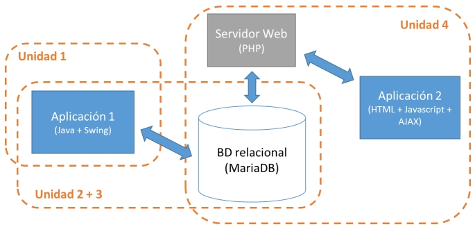
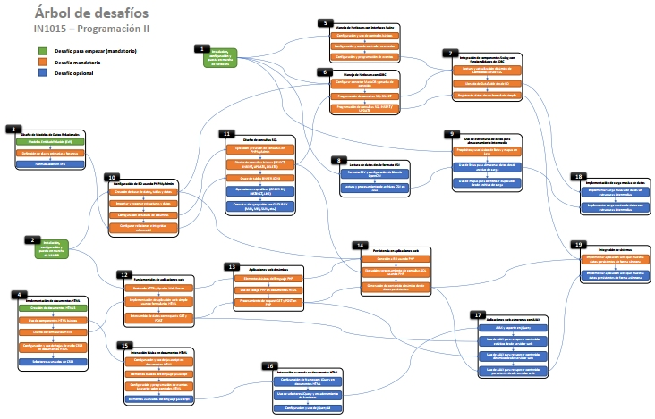
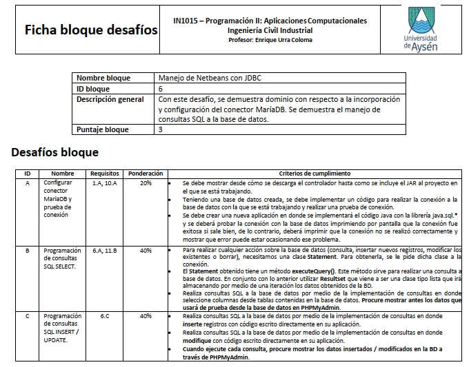
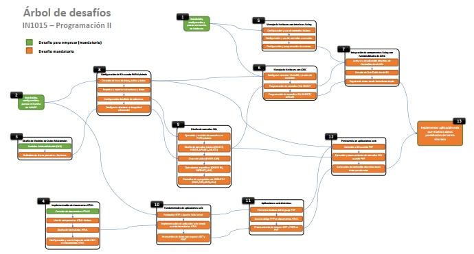

# The tree of challenges - and how to adapt to a pandemic and to AI
> *Author*: Enrique Urra - enrique.urra@gmail.com

>* The *COVID pandemic in 2020* and the arise of *Artificial Intelligence (AI)* coding tools and systems forced us to rethink about how our programming teaching methodologies were designed towards online environments. It was relevant to switch from a *result-focus* to a *process-focus*.
>* I had the experience of adapting traditional programming courses towards what I called a *tree of challenges*, a methodology based on several *mini challenges* that students must resolve in order for learning and for demonstrating their knowledge. It is a *tree* because I arranged all the challenges in a tree of dependencies between them.
>* After some applications, results of the tree of challenges were satisfactory. End qualifications and course approval improved in about **33% and 28%** respectively regarding previous versions with more traditional methodologies.
>* [There is an example](tree-diagram-final.pdf) of a recent version of the tree, for which a [file template](file-example.pdf) was used to define, detail and evaluate challenges.

The COVID pandemic in 2020 changed our ways of interacting in a learning environment. All those human interactions between teachers and students mutated towards online workspaces of matrix-webcam classrooms. It was common to have these sessions in where only a few students had their cam online, and with the others it was to teach or speak with a black screen. Depending on each one situation, it was a pretty tough or a comfortable experience. 

Resilience was the key, and from that, as teachers, we had to find methodologies and strategies to assure an efficient learning experience for students. In programming courses was particularly challenging, considering that our traditional methods for evaluating coding skills are based on results that students produce when solving specific problems. There are more or less technological approaches for that, from completely write code in paper to encapsulated programming environments without internet accesses to external contents. We highly worried about how students were evaluated for their real knowledge and not by external help, and to assure that in online environments was difficult.

The arise of *Artificial Intelligence (AI)* coding tools and systems deepened such concerns. For me was revealing the first time that I used ChatGPT for querying some code, and how It could represent a game-changer in programming learning. In time, I understood that with all these changes, we definitely need to move from a *result-focus* to a *process-focus* in teaching and learning programming. The coding artifact *per se* that produce the student is not the relevant thing, but the *methodology and the process* that him or her use to reach such artifact.

This scenario motivated me in 2020 to implement profound methodology adaptations in programming courses that I traditionally taught. Particularly, there was this project-based course in which students must gradually implement a simple but diverse software architecture, one such as this image:

Students had to learn many technologies and languages in a practical approach (without deepen so much on each), and they had to excel in how integrate and give life to such system. It should have three main components: a client-server app (leftmost one) implemented with Java tools, a web app (rightmost one) implemented with PHP+JS+AJAX, and a central relational database (in middle), for which they had to learn basic modelling and SQL with MariaDB. Pre-2020 I used a traditional teaching and evaluation methodology approach for this course: several contents were taught, programming practice in specific examples was done and in-site evaluations were performed. 

With pandemic and online teaching, I changed this methodology towards what I called a **tree of challenges**. It was a methodology design based on several *mini challenges* that students must resolve in order for learning and for demonstrating their knowledge. With mini challenges I refer to very specific programming exercises that represent a smaller or gradual advancement on a specific topic relevant for the course. It is a *tree* because I arranged all the challenges in a tree of dependencies between them, in a way such that students must complete several challenges to consistently advance towards others. The earlier the challenge within the tree the easier it is, while the later within the tree the harder it is.

There diagram of the first version of the tree looks like this:

In this version we implemented *mandatory* (orange) and *optional* (blue) challenges. The latter ones allowed students to improve their evaluations if they wanted to. Each orange or blue block had specific instructions and assessment criteria about how to successful complete the challenge. For this, a specific *file* for each group of challenges was developed, in a format as follows:

This format specifies the scores that are achieved when each challenge is successful completed. And for that comes the *evaluation* aspect of the methodology. Rather than traditional in-site evaluations or other kind of product, the students were asked to create *video tutorials* in where they can address one or more challenges at the same time. On these video tutorials, they had to live demonstrate how to implement or develop features defined for the challenge. This could be done through live coding and/or by reusing implemented features that have been shown in previous challenges. Several constraints and rules were specified for creating this video tutorial, such as maximum time and the requirement of be actively presenting (webcam on) during the video playback. This approach allowed us to effectively translate the product-focus of the programming evaluation towards a process-focus: it is more important that the student show us on video *how he or she is solving the problem*, rather than blindly evaluate only the final result.

The challenge tree presented before, as a first version, allowed us to evaluate perceptions of the methodology usefulness for both teaching and learning. One of the first conclusions was that the challenge design and arrangement in the tree was too complex for the level of the students, so several simplifications has to be made. This resulted in a new tree version, more succinct and with fewer rules, such as the following:

After some applications of the methodology, results were satisfactory. End qualifications and course approval improved in about **33% and 28%** respectively regarding previous versions with more traditional methodologies. For some students, the progress between the first video tutorials and the latter ones was evident, showing a clear understanding of the code and the concepts that they developed, reviewed and explained in videos. There were some elements to improve, for example, this methodology demanded higher levels of autonomy to students, which was a big challenge for them at their level. In any case, it was a successful experience even for pandemic times in where teaching and learning experiences struggled in the need of adapt. [You can see the final versions of the tree of challenges here](tree-diagram-final.pdf) and [an example of a file](file-example.pdf) through which specific challenges were defined, detailed and evaluated.