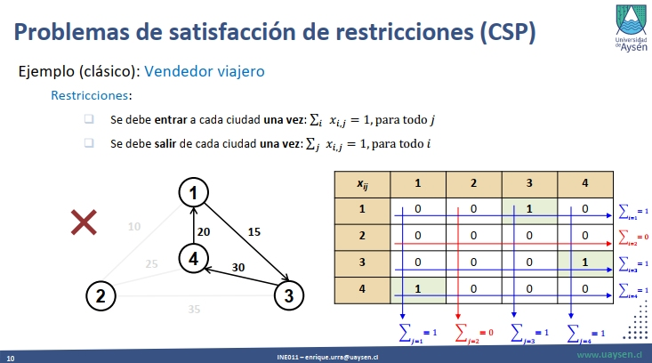

# When the problem is the problem
> *Author*: Enrique Urra - enrique.urra@gmail.com

>* More advanced learners who are used to programming languages concepts and mechanics can focus on *harder problems*. At these stages, to teach such problems is a challenge.
>* *Constraint Satisfaction Problems (CSPs)* are an example of optimization-related problems that are hard to teach because of their mathematical formalities and definitions.
>* In the past I had to explain the *Multidimensional 0-1 Knapsack Problem (MKP)*, a basic but challenging CSP to learn. It was useful to develop [a simple interactive user interface](https://html-preview.github.io/?url=https://github.com/eurra/teaching-exps/blob/main/csp/mkp-viewer/index.html) in which a MKP instance can be loaded and a solution can be constructed step-by-step, allowing students to understand variables, constraints and domain particularities.
>* I also developed some material [here](CSPs-material.pdf) (check slides 5-13) for the *Travelling Salesman Problem (TSP)*, another  classic CSP. With this, a visual presentation of the domain and its variables allowed students to better understand data structures required to programming solvers for the problem, and how constraints work on them.

Sometimes, The coding part of solving a specific problem is not the main struggle when learning programming, but to clearly understand the problem itself that is being solved. The more beginner the learner, more time is spent on learning language concepts and mechanics, commonly over basic problems. The more advanced is the learner, more time is spent on problems rather than languages, so the addressed problems can become more harder. I commonly illustrate this situation to early-years students with this graph:

The green curve means the struggle of the learner when using programming languages, while the blue one means his capabilities for solving problems through programming. This graph represents the *successful* learning process: at some point in time, the blue curve should surpass the green one, i.e., the *language domination point*. At this point, the learner can further concentrate more on the problems than the tool (the programming language), thus his problem solving skills can develop faster.

On the other side, learners may get in the following situation:

which is the inverse one. The learner stagnate on understanding the language, and the problem solving skills never develop. These are commonly the situation of student dropouts. The ideal process should motivate the green curve to descend as quickly as possible.

For advanced students, I commonly spend more time addressing problems on more advanced subjects. In the past I had the opportunity of teaching optimization topics related to my past research, particularly *heuristic algorithms*. These tools are suited for finding good solutions (non necessarily optimal) of very complex combinatorial problems, i.e. the ones in which you need to set values to a very large number of variables, and from that, calculate some kind of quality metric that tells you the solution fitness. In formal terms, these problems are commonly represented and know as *Constraint Satisfaction Problems (CSP's)*. So, to understand heuristic algorithms, previously one must understand CSPs.

And guess that, to teach and to understand CSPs is hard! That is because, formally speaking, a CSP is expressed through a mathematical model that abstract all the components of the domain. For example, consider the *Multidimensional 0-1 Knapsack Problem (MKP)*, a CSP whose explanation can be summarized as follows:

- There is a set of *knapsacks*, each one with a specific *resource capacity*.
- There is a set of *items* that can be selected in a specific solution.
- When a item is selected, it consumes a specific amount of resources *for each knapsack*, and this quantity can be different for each knapsack.
- Each item yields a specific *profit* when selected.
- The goal of the problem is to find a subset of items that yields maximum profit without exceeding the resource capacities for all the knapsacks.

The formal mathematical model for the above description is the following:

Maximize $z = \sum_{j=1}^{n}{c_j x_j}$, subject to:

$\sum_{j=1}^{n}{a_{ij} x_{ij}} \le b_i, \qquad i \in M = \{1,2,...,m\}$

$x_j \in \{0,1\}, \qquad j \in N = \{1,2,...,m\}$

with $M$ the set of knapsacks, $N$ the set of items, $c_j$ is the profit that yields the $j$ item, $a_{ij}$ is the amount of resources that the item $j$ consume from knapsack $i$ when selected and $b_i$ is the resource capacity of the knapsack $j$.

Rather than explaining the structure of this problem from the mathematical definitions, I wanted to visualize and interact with its components, in a way such that learners can understand the meaning of each variable beyond formalities. For that, [I developed a simple interactive user interface](https://html-preview.github.io/?url=https://github.com/eurra/teaching-exps/blob/main/csp/mkp-viewer/index.html) in which a MKP instance can be loaded and a solution can be constructed through selecting items:

In there you can visualize the main variables (knapsacks, items, profits and capacity/consumption restraints) in a matrix format, and select items step-by-step, visualizing how capacity constraints of knapsack are addressed. When constraints are violated, the UI highlights that:

This tool was extremely useful for students, allowing them to understand in a more straightforward manner the formalities of the math model.

Another case in where the challenge is to learn the problem is the well known *Travelling Salesman Problem (TSP)*, a CSP which can be summarized as follows:

- There is a network of cities with a specific distance (cost) between each pair of them.
- Distance is the same in *both ways*: distance from A to B is the same from B to A.
- The goal of the problem is to visit *each city once*, starting from an origin city and returning to it at the end of the schedule.

In this way, besides the mathematical model itself, it is pretty useful to visualize the cities network and each travelling distance in a matrix format:

Moreover, in this format one can exemplify how a schedule is constructed step-by-step and how constraint of the mathematical model are satisfied or violated, allowing the learners to bridge the understanding between the model itself and the domain concepts:

These artifacts were useful for translating the problem analysis into a data structure design. For example, the matrix showed in the example was further modelled in the code implementation that students developed for solving TSP instances. [You can see the complete material here](CSPs-material.pdf), in which these (slides 5-13) and other visual explanations regarding CSPs are presented.