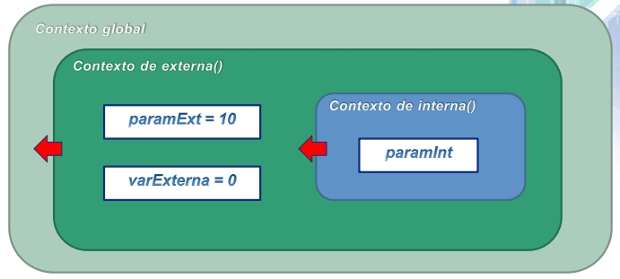
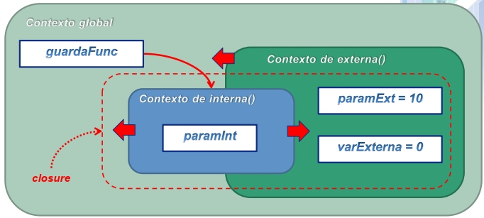
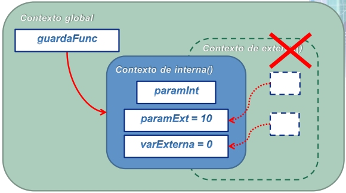

# Getting a *closure* with Javascript

>* A *closure* is a pivotal Javascript language feature, widely used for implementing frameworks and tools. When you understand how it operate, you learn that it is present in all places.
>* To teach how a closure work is hard, because you need to understand several rules of the language regarding *data* (variables) and *scopes* in where such data is defined.
>* I developed some useful visual examples [here](JS-material.pdf) (check slides 7-10) that allows to explain how closures work, step-by-step, and to understand the results of related code examples.

*Javascript* is a extremely flexible language. In contrast to other languages like Java (students always confuse both), whose implementation started with specific programming paradigms and gradually incorporated new ones (e.g. functional), Javascript from the beginning started as a mix of multiple paradigms, focused particularly on *prototypes*. Higher levels of flexibility on a programming language are not free, and they become with the need of discipline standards when creating and organizing code.

Because of that, Javascript comes in a number of flavors and styles, guided through the adoption of well-know frameworks and systems such as *Node.js*, *React*, *Vue*, *Angular*, *JQuery*, *Typescript*, etc. All these provide us those standards and code structure needed to deal with higher levels of flexibility. And so, it has become one of the most widely programming languages used for web application development.

I started to learn and understand specific Javascript features when I had to teach web app development. Even before, as developer, I didn't have the need to understand too specific features, precisely because high-level features provided by frameworks. But there is a point where you need to deepen on how these features work, specially when you need to teach them.

In that journey, I came across with this concept of *closure*. Again, this is not an exclusive feature of Javascript, but in some way it is widely used for implementing framework features and tools. Actually, when you understand how it operate, you learn that it is present in all places, and it is pivotal for applying concepts such as *first-class functions*.

As OO, to teach how a closure work is hard, because you need to understand several rules of the language regarding data (variables) and *scopes* in where such data is defined. In brief, you need to understand that:

- When a specific code is executed, a specific scope is created from such code.
- Any data defined within a code is *"captured"* by the scope created when such code is executed.
- As different codes in the language can be nested (e.g., a `function` within other `function`), the related scopes created when executing such codes also will nest.
- Any data captured within a parent scope will be also captured within its children (nested) scopes. This is actually the *closure* creation.
- A parent scope can disappear (i.e., its execution finishes) and its children scopes could continue existing.
- In the above case, even if the parent scope disappeared, the data defined on such parent scope remains captured by those children scopes that continue existing.

These pretty abstract rules can be summarized in the following code example:

```javascript
function externa(paramExt) {                    // Receives 10 from (a)
    var varExterna = 0;

    function interna(paramInt) {                // Receives 5 from (b)
        varExterna++;                           // Changes to 1 in (b)
        return paramInt + paramExt + varExterna;
    }

    return interna;
}

var guardaFunc = externa(10);                   // (a)
alert(guardaFunc(5));                           // (b), prints "16"
```

Even so, it is not trivial to understand that. In the past I worked on some material which allowed me to explain these mechanisms *visually*. For that, it is important to visualize the scopes that are generated when this code is executed, and how data is captured by them, *step-by-step*. For example, one can show three-steps for the above code:

1. When the code in `externa` is executed, generating a parent (`externa`) and a child (`interna`) scope:



2. When the parent scope (`externa`) is finishing, even if the children scope (`interna`) remains active because is being referenced from the global scope:



3. When the parent scope (`externa`) disappears, and even that, as the children scope (`interna`) remains active, the data defined by such parent scope remains captured by the children scope:



With this visual aid, it was pretty straightforward to explain closures to students, and to better understand the behavior of the code presented before. [You can see the complete material here](JS-material.pdf), in which these (slides 7-10) and other visual explanations (and code repositories) regarding Javascript mechanisms are presented.